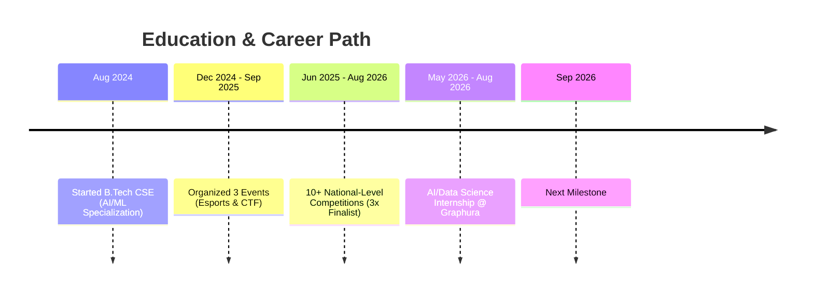

<!-- HEADER: animated typing SVG -->
<div align="center">
  
</div>

<div align="center">
  <a href="https://linkedin.com/in/madhav-gagneja" target="_blank"></a>
  <a href="mailto:gagnejamadhav24@gmail.com"></a>
  <a href="https://www.hackerrank.com/profile/gagneja_madhav21" target="_blank"></a>
  <a href="#" target="_blank"></a>

  <br/><br/>
  
</div>

<br/>

## About Me

I'm a Computer Science Engineering student specializing in **Artificial Intelligence & Machine Learning**, focused on building intelligent, data-driven solutions for real-world problems. My interests sit at the intersection of **AI, Data Science, Cloud Computing, and Cybersecurity**.

- **Data Science & Analytics** — Hands-on experience in financial risk analysis and dashboard development using Python, SQL, and Tableau. Completed industry simulations with **Deloitte** and **Goldman Sachs** (via Forage).
- **Competitive Growth** — Participated in 10+ national-level hackathons, ideathons, and cybersecurity competitions (including CTFs), with finalist positions in 3 major events.
- **What I Build** — Systems combining AI, automation, and machine learning — from fraud and scam detection engines to data automation pipelines.
- **Always Learning** — Exploring emerging tech and looking to contribute to forward-thinking teams driving innovation.

```text
Focus Areas   : Artificial Intelligence · Machine Learning · Data Science · Cybersecurity · Cloud Computing
Based in      : India
Achievements  : 10+ national-level competitions · 3x Finalist
Currently     : Building AI-powered detection & automation systems
Open to       : Internships, collaborations & opportunities in AI/ML and Data Science
```

---

## My Journey



<table>
<tr>
<th width="20%">When</th>
<th width="80%">Milestone</th>
</tr>
<tr>
<td valign="top"><b>Aug 2024</b></td>
<td>Started B.Tech in Computer Science Engineering, specializing in <b>AI/ML</b></td>
</tr>
<tr>
<td valign="top"><b>Dec 2024 – Sep 2025</b></td>
<td>Organized 3 successful events, including <b>Esports</b> and <b>CTF</b> competitions</td>
</tr>
<tr>
<td valign="top"><b>Jun 2025 – Aug 2026</b></td>
<td>Competed in <b>10+ national-level competitions</b> — Finalist in 3</td>
</tr>
<tr>
<td valign="top"><b>May 2026 – Aug 2026</b></td>
<td>Data Science & AI Internship at <b>Graphura</b> — building a full-stack job intelligence and fraud detection platform</td>
</tr>
<tr>
<td valign="top"><b>Sep 2026</b></td>
<td>Next milestone — coming soon</td>
</tr>
</table>

---

## Tech Stack

<table>
<tr>
<td valign="top" width="50%">

**Languages**
<br/>


</td>
<td valign="top" width="50%">

**AI / ML & Data**
<br/>


</td>
</tr>
<tr>
<td valign="top" width="50%">

**Web & Frontend**
<br/>


</td>
<td valign="top" width="50%">

**Tools & Cloud**
<br/>


</td>
</tr>
</table>

---

## Featured Projects

<table>
  <tr>
    <td width="50%" valign="top">
      <h3>Credit Card Fraud Detection</h3>
      <p>Machine learning pipeline to track, identify, and classify anomalous transaction behavior using predictive modeling.</p>
      <a href="#"><code>View Repository →</code></a>
    </td>
    <td width="50%" valign="top">
      <h3>Company Data Automation Pipeline</h3>
      <p>Automated scraping and ingestion architecture that harvests corporate data and streamlines backend data flows.</p>
      <a href="#"><code>View Repository →</code></a>
    </td>
  </tr>
  <tr>
    <td width="50%" valign="top">
      <h3>Automated Resume Scorer</h3>
      <p>AI-driven resume vetting tool that parses resumes and scores alignment against target job descriptions.</p>
      <a href="#"><code>View Repository →</code></a>
    </td>
    <td width="50%" valign="top">
      <h3>Job Scam Detection Engine</h3>
      <p>NLP-based system that flags fraudulent and malicious job postings using keyword, regex, and feature-based scoring.</p>
      <a href="#"><code>View Repository →</code></a>
    </td>
  </tr>
  <tr>
    <td colspan="2" valign="top">
      <h3>Advanced Coding & Language Mastery Lab</h3>
      <p>A structured repository spanning foundational scripts to advanced algorithmic patterns — covering core paradigms, data structures, and developer tooling.</p>
      <a href="#"><code>Explore the Lab →</code></a>
    </td>
  </tr>
</table>

---

## Currently Working On

<table>
<tr>
<td width="33%" align="center">

**Research**
<br/>
Exploring ML model evaluation techniques & scalable backend architecture

</td>
<td width="33%" align="center">

**Security**
<br/>
Practicing CTFs & cybersecurity challenges to sharpen offensive/defensive skills

</td>
<td width="33%" align="center">

**Cloud**
<br/>
Learning cloud-native deployment for AI/ML pipelines

</td>
</tr>
</table>

---

## GitHub Analytics

<p align="center">
  
  &nbsp;
  
</p>

<p align="center">
  
</p>

---

## Let's Connect

I'm always up for discussing AI/ML projects, hackathon ideas, or cybersecurity challenges. Feel free to reach out.

<p align="center">
  <a href="https://linkedin.com/in/madhav-gagneja"></a>
  <a href="mailto:gagnejamadhav24@gmail.com"></a>
</p>

---

<div align="center">
  
</div>
