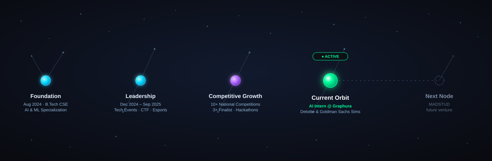

<!-- ============================================================ -->
<!-- PROJECT AEGIS — GITHUB PROFILE README                        -->
<!-- Sprint 2 · Production Asset · v1.0                           -->
<!-- Owner: Madhav Gagneja                                        -->
<!-- ============================================================ -->

<!-- ============ HERO ============ -->

  

 

**Engineering intelligent systems that transform data into secure, scalable and autonomous solutions.**

Bridging the gap between secure autonomous systems and market-ready brands · I build scalable ventures where engineering meets innovation.

Computer Science Engineering · Artificial Intelligence & Machine Learning Specialization

 

<!-- divider :: data-stream -->

<!-- ============ ENGINEERING DASHBOARD ============ -->

## 🛰️ Engineering Dashboard

| CURRENT MISSION | CURRENT BUILD | RESEARCH FOCUS |
|:---:|:---:|:---:|
| **AI Job Intelligence Platform** | `In Development` | **AI Agents & Autonomous Systems** |

| Domains Active | Systems Deployed | Status |
|:---:|:---:|:---:|
|  |  |  |

<!-- ============ ABOUT ============ -->

## 🧠 About

<table align="center">
<tr>
<td width="60%" valign="top">

I'm an engineer building toward production-ready intelligent systems — not a "student learning AI," but someone architecting the infrastructure, models, and security layers that let autonomous systems operate reliably at scale.

Currently building the **AI Job Intelligence Platform** as an AI Intern at Graphura, alongside the Deloitte Data Analytics and Goldman Sachs Risk Management simulations — production-oriented work, not classroom exercises.

Long-term, this work is the foundation for **MADSTUD** — a future technology company. Right now, the focus is singular: building a rigorous, production-grade personal engineering ecosystem across AI, ML, data, cloud, and security.

</td>
<td width="40%" valign="top">

**◈ Profile Readout**

| | |
|---|---|
| `ROLE` | AI/ML Engineer |
| `INTERNSHIP` | Graphura — AI Intern |
| `SIMULATIONS` | Deloitte · Goldman Sachs |
| `FOCUS` | AI Job Intelligence Platform |
| `NEXT ORBIT` | MADSTUD *(future)* |

</td>
</tr>
</table>

<!-- ============ ENGINEERING DOMAINS ============ -->

## ⚙️ Engineering Domains

<table align="center">
<tr>
<td width="50%" valign="top">

### 🧠 Artificial Intelligence

</td>
<td width="50%" valign="top">

### 📊 Machine Learning

</td>
</tr>
<tr>
<td width="50%" valign="top">

### 🗄️ Data Engineering

</td>
<td width="50%" valign="top">

### ☁️ Cloud Infrastructure

</td>
</tr>
<tr>
<td width="50%" valign="top">

### 🛡️ Cybersecurity

</td>
<td width="50%" valign="top">

### 🔁 Automation & Intelligent Systems

</td>
</tr>
</table>

<!-- ============ CAREER CONSTELLATION ============ -->

## ✦ Career Constellation

<!--
  Career Constellation asset lives at: assets/timeline/career-constellation.svg
  It's a standalone SVG (not inline in this .md), so GitHub renders it as a
  real image — the pulsing green "Current Orbit" ring animates natively via
  SMIL <animate>, no JS required. To add/edit nodes, open the SVG directly.
-->

<!-- ============ FLAGSHIP SYSTEMS ============ -->

## 🚀 Flagship Systems

<!--
  CARD TEMPLATE — copy the <td>...</td> block below into a new column
  inside the <tr> to add a project. Keep width="33%" for a 3-up grid;
  drop to width="50%" if you're only ever showing 2, or width="25%" for 4.

  <td width="33%" valign="top" align="center">

  **PROJECT NAME**
   Domain Tag · Domain Tag
    
  One-sentence description: what it does + the problem it solves.
    
  
   
  [`View System →`](https://github.com/madhav-gagneja/REPO_NAME)

  </td>

  Status badge color key (keep consistent across all cards):
    DEPLOYED   → 00FF9D (cyber green)
    IN_DEV     → 00D9FF (AI cyan)
    RESEARCH   → B366FF (purple neural glow)
    ARCHIVED   → 6E7681 (muted grey)
-->

<table align="center">
<tr>
<td width="33%" valign="top" align="center">

**AI Job Intelligence Platform**
 Artificial Intelligence · Automation
  
Autonomous pipeline that sources, ranks, and matches job intelligence using LLM-driven agents.
  

 
[`View System →`](#)

</td>
</tr>
</table>

More flagship systems land here as repos ship — see template comment above.

<!-- ============ RESEARCH ============ -->

## 🔬 Research

**Current Focus:** AI Agents & Autonomous Systems

Exploring how intelligent agents can operate reliably in production — reasoning loops, tool orchestration, and safe autonomy under real-world constraints.

<!-- ============ GITHUB ANALYTICS ============ -->

## 📡 GitHub Analytics

<!--
  Self-hosted via .github/workflows/metrics.yml (lowlighter/metrics),
  regenerated daily and committed to this repo as a static SVG. This
  replaces the old github-readme-stats.vercel.app / top-langs calls,
  which broke when that shared public instance was paused (Jan 2026).
  No external service to go down — this file lives in your own repo.
-->

  

<!-- Streak Stats kept external — streak-stats.demolab.com is a separate,
     independently-hosted service and was NOT part of the outage. -->

<!-- ============ ACHIEVEMENTS ============ -->

## 🏆 Achievements

<!--
  Achievements are generated by the same metrics.yml workflow
  (plugin_achievements: yes) inside github-metrics.svg above, so this
  section no longer calls github-profile-trophy.vercel.app — that was
  the second broken image, same root cause (shared free public instance).
-->

Achievement badges are included in the GitHub Analytics panel above (Achievements plugin).

<!-- ============ SOCIAL / FOOTER ============ -->

### Connect

<!-- Portfolio (madhav-gagneja.in) and Linktree (madhav-gagneja.dev) are queued to launch
     after this README ships — add their badges back in once live:

-->

  

MISSION STATUS: ACTIVE — Engineering intelligent systems that transform data into secure, scalable and autonomous solutions.

